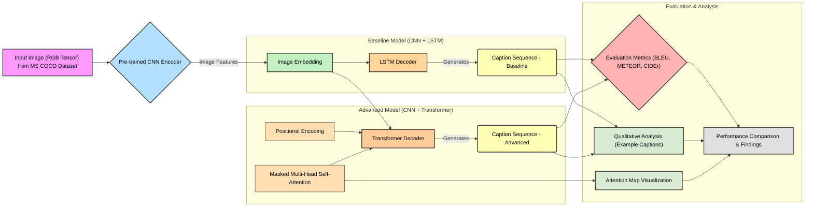

# img2text-transfer-attn
img2text-transfer-attn is a modular image-captioning codebase for MS COCO. A pre-trained CNN encodes images into feature embeddings, which are decoded by either an LSTM or a Transformer with masked multi-head attention and positional encodings. Easily swap encoders or fine-tune layers.

## Architecture

The following diagram illustrates the architecture of the Image-to-Text Generation system, detailing both the baseline (CNN + LSTM) and advanced (CNN + Transformer) models.

